# Yunzai-plugin-railwaytools

[项目简介](#项目简介) · [快速开始](#快速开始) · [命令速查](#命令速查) · [功能截图](#功能截图) · [运行方式](#运行方式) · [常见问题](#常见问题) · [许可](#数据来源与许可)

## 项目简介

RailwayTools 是面向 QQ 群的 Yunzai-Bot 铁路助手。它把车迷常用的列车、车组、车站、线路查询与 12306 余票能力放进同一套 `#` 命令中；详细结果优先生成图片，渲染不可用时自动返回原文字。

| 想解决的问题 | 插件直接提供 |
| --- | --- |
| 车次信息分散，来回切换多个页面 | 车型、担当、配属、停站时刻和运行状态一次返回 |
| 群友输入不规范，命令容易失效 | 大小写、连续空格、Tab、全角 `#` 和复制空白自动兼容 |
| 12306 结果多，查票与蹲票步骤重复 | 余票、票价、10 趟分页、精确站名和定时检查 |
| 群消息太长，文字难以阅读 | 统一图片排版；失败时只回退一次完整文字 |

### 一套命令，三个使用场景

| 查列车 | 查站线 | 查车票 |
| --- | --- | --- |
| 车次详情、动车组担当、实时状态 | 车站大屏、车站资料、线路与沿途站 | 余票票价、下一页、定时查询与取消 |
| `#车次 G2755` | `#大屏 上海` | `#查询车票 北京南 上海虹桥 明天` |

## 快速开始

要求：Linux、Node.js 18.18 及以上、Yunzai-Bot V3 或兼容实现。

在 Yunzai-Bot 根目录执行：

~~~bash
git clone https://github.com/help660vip/Yunzai-plugin-railwaytools.git plugins/Yunzai-plugin-railwaytools
~~~

插件没有额外 npm 运行时依赖。重启 Yunzai-Bot，发送 `#车迷帮助`；收到上方菜单即表示加载成功。

更新时执行：

~~~bash
git -C plugins/Yunzai-plugin-railwaytools pull
~~~

## 命令速查

| 场景 | 命令 | 说明 |
| --- | --- | --- |
| 总菜单 | `#车迷帮助` | 所有铁路与车票入口 |
| 列车详情 | `#车次 G2755` | 区间、车型、担当、配属与停站 |
| 动车组反查 | `#车次 CR400AFAE-2402` | 查询近期担当车次 |
| 车组担当 | `#车号 G2755` | 查询近期担当动车组号 |
| 列车查询 | `#查询 G2755` | 与车次详情相同；可追加 `-实时` |
| 实时状态 | `#实时 G2755` | 当前状态、参考站点与正晚点 |
| 车站大屏 | `#大屏 上海` | 列车、候车位置与状态 |
| 线路资料 | `#线路 京沪高铁` | 线路信息与沿途车站 |
| 车站资料 | `#车站 上海` | 国铁站；名称后加“地铁站”可查地铁站 |
| 车票查询 | `#查询车票 北京南 上海虹桥 明天` | 余票、席别、票价与分页 |
| 定时查票 | `#定时查询车票 湖州 厦门北 明天 14-16 10分钟` | 指定日期、时段和间隔 |
| 取消查票 | `#取消查询车票` | 结束当前定时任务 |
| 继续翻页 | `#下一页` 或 `next` | 每页 10 趟，5 分钟内有效 |
| 车票帮助 | `#车票帮助` | 日期、精确站名与定时格式 |

简写：`#ch`、`#cc`、`#cx`、`#ss`、`#dp`、`#xl`、`#cz`。英文车次与简写不区分大小写。

<strong>展开车票日期、精确站名与定时规则</strong>

### 日期

不填日期或日期早于今天时，按今天查询。支持：

~~~text
今天 / 明天
today / tomorrow
2026-08-16
2026年8月16日
~~~

### 精确站名

参数放在命令末尾：

- `-精确站名`：精确匹配发站和到站。
- `-精确发站`：只精确匹配出发站。
- `-精确到站`：只精确匹配到达站。

~~~text
#查询车票 北京 上海 明天 -精确站名
#定时查询车票 湖州 厦门北 14-16 10分钟 -精确发站
~~~

### 定时与翻页

时段格式为 `小时-小时`，间隔格式为 `N分钟` 或 `N小时`。机器人先立即查询；当前无票时才创建任务，之后最多再查 9 次。发现余票、达到次数上限或收到 `#取消查询车票` 后停止。

普通查询每页显示 10 趟列车。发送 `#下一页` 或 `next` 后，会话有效期重新计算为 5 分钟。

## 功能截图

下列 PNG 均由 `npm run test:render` 使用真实接口数据和 Chrome Headless 生成。完整尺寸和执行结果见 [命令验证报告](command-render-tests/report.md)。

<strong>帮助菜单</strong>

| 车迷帮助 | 车票帮助 |
| --- | --- |
|  |  |

<strong>列车与车组：5 项</strong>

| 车次详情 | 动车组反查 |
| --- | --- |
| 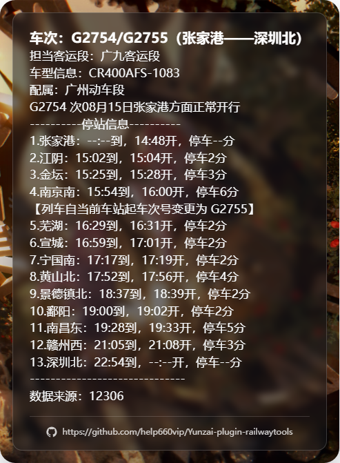 | 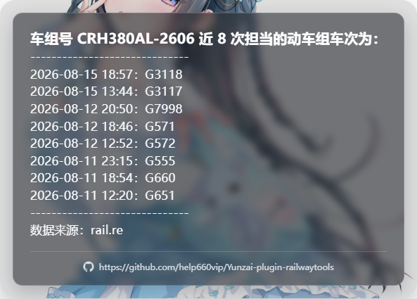 |

| 车组担当 | 列车查询 |
| --- | --- |
| 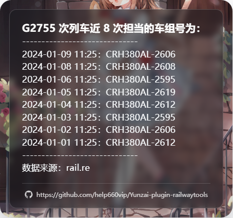 | 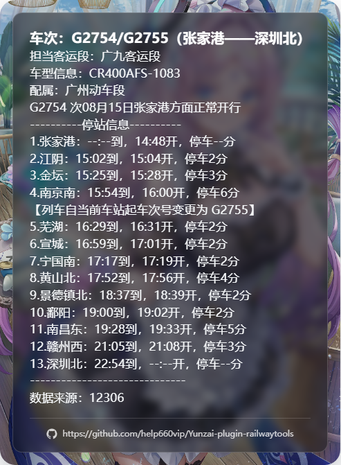 |

| 实时状态 |
| --- |
| 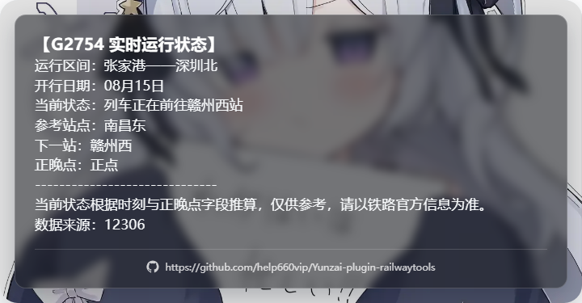 |

<strong>车站与线路：3 项</strong>

| 车站大屏 | 线路资料 |
| --- | --- |
| 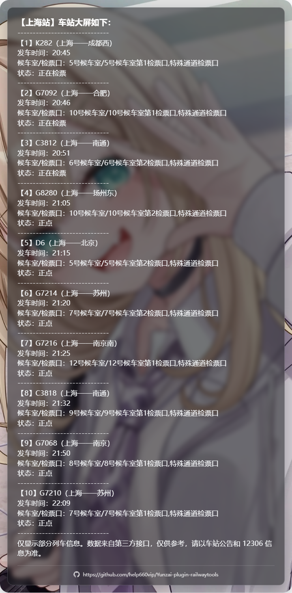 | 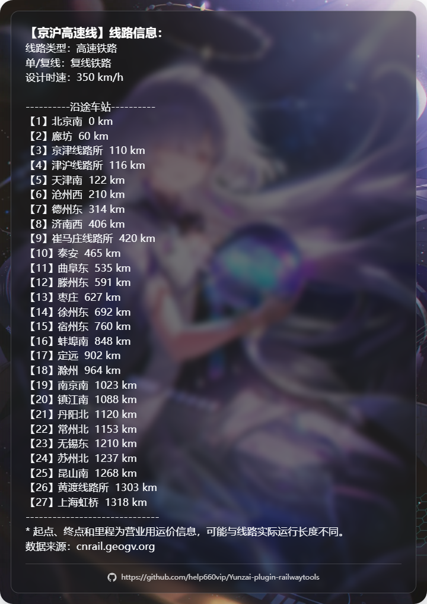 |

| 车站资料 |
| --- |
|  |

<strong>12306 车票：4 项</strong>

| 车票首页 | 下一页 |
| --- | --- |
| 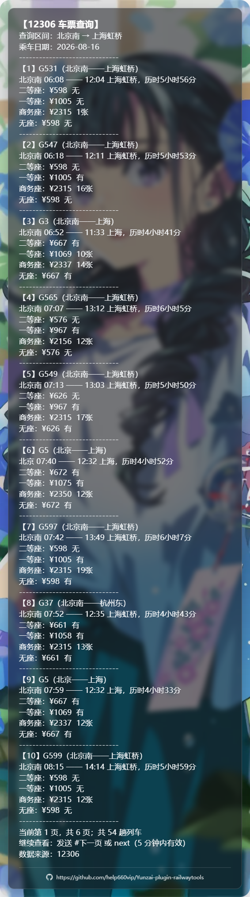 | 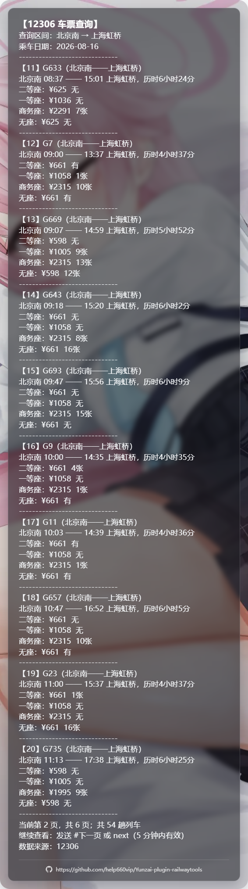 |

| 定时查询 | 取消查询 |
| --- | --- |
| 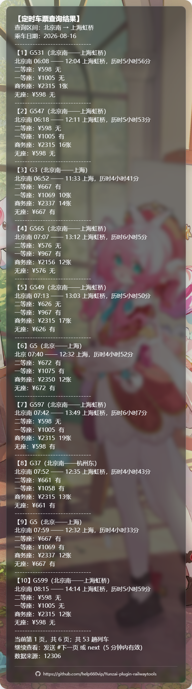 | 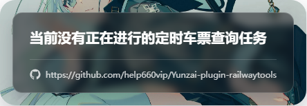 |

## 运行方式

### 图片

正式运行只复用 TRSS-Yunzai 共享 Puppeteer，不安装额外截图包。Linux 建议提供 `WenQuanYi Micro Hei` 或 `Noto Sans CJK SC` 中文字体。Puppeteer 缺失、超时或截图失败时，插件只回复一次原始文字。

### 缓存

默认缓存位于 Yunzai 进程内存，不要求 Redis、不写磁盘，重启后自动清空。余票使用秒级缓存，票价使用分钟级缓存，站名、车站和线路使用小时到天级缓存；同一键的并发请求会合并。

<strong>查看具体缓存时间</strong>

| 数据 | 新鲜缓存 | 数据源异常时的短期回退 |
| --- | ---: | ---: |
| 车站大屏 | 20 秒 | 1 分钟 |
| 12306 余票 | 15 秒 | 30 秒 |
| 列车时刻与状态 | 1 分钟 | 4 分钟 |
| 动车组担当 | 5 分钟 | 30 分钟 |
| 12306 票价 | 15 分钟 | 1 小时 |
| 车站名称与电报码 | 24 小时 | 7 天 |
| 线路与车站详情 | 24 小时 | 7 天 |

插件没有必填配置文件。服务器需能访问 12306、rail.re、车站大屏和 cnrail；单个数据源异常不会影响其他命令。

## 目录结构

~~~text
Yunzai-plugin-railwaytools/
├─ apps/                    Yunzai 规则与命令处理
├─ model/                   API、缓存、业务、会话与渲染
├─ test/                    node:test 单元与加载测试
├─ command-render-tests/    真实接口检查与功能截图
├─ docs/                    维护者文档
├─ .github/workflows/       Linux CI
├─ index.js                 插件入口
├─ package.json             Node.js 元数据与命令
├─ NOTICE.md                来源与版权声明
├─ CHANGELOG.md             版本变化
└─ LICENSE                  GPL-3.0 许可证
~~~

实现边界、缓存接口和截图验证方式见 [维护说明](docs/maintenance.md)。

## 常见问题

<strong>安装后没有响应</strong>

确认插件位于 `plugins/Yunzai-plugin-railwaytools`，Node.js 版本满足要求，并在安装或更新后完整重启 Yunzai-Bot。检查启动日志中的插件加载错误。

<strong>为什么返回文字而不是图片</strong>

当前实例没有共享 Puppeteer，或本次截图超时。文字业务内容与图片一致，查询仍然有效。

<strong>为什么车票站名查询失败</strong>

使用 12306 收录的完整站名，例如“北京南”“上海虹桥”。需要限制列车实际发站或到站时，在命令末尾加入精确参数。

<strong>为什么定时任务没有创建</strong>

定时命令会先立即查询。如果已有可售余票，机器人直接返回结果，不再轮询。每位用户在同一会话中只保留一个任务。

## 数据来源与许可

列车时刻、运行字段、车站电报码、余票与票价来自 12306；动车组担当来自 rail.re；车站大屏来自 12036.com 第三方接口；车站与线路资料来自 cnrail.geogv.org。数据源名称仅用于说明结果来源，各服务的权利和使用条件归其所有者。

项目保留以下来源的版权和许可声明：

- [leaf2006/nonebot-plugin-railwaytools](https://github.com/leaf2006/nonebot-plugin-railwaytools)
- [leaf2006/nonebot-plugin-12306-ticket](https://github.com/leaf2006/nonebot-plugin-12306-ticket)

详细声明见 [NOTICE.md](NOTICE.md)。项目以 [GNU General Public License v3.0](LICENSE) 发布。
